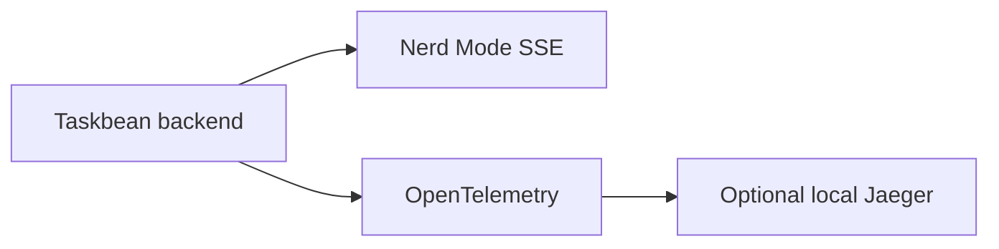

Open Nerd Mode from the app or navigate to `/?nerd=1`.

| Tab | What it shows |
| --- | --- |
| Events | Live application span events with category filters and text search |
| Metrics | Sparkline cards for AI calls, errors, task extraction, commands, uploads, reminders, active tasks, and latency |
| Traces | A Jaeger waterfall for correlated spans |
| Logs | Severity-filtered Python log records with trace correlation when available |

## Local telemetry path



Events stream through `GET /api/telemetry/stream`. A recent snapshot is available at `GET /api/telemetry/snapshot`.

Jaeger is optional:

```bash
cd app
docker compose up -d
```

Without Jaeger, the Events, Metrics, and Logs paths still work. The Traces waterfall requires the local Jaeger service.

## Privacy boundary

Automatic agent-usage ingestion stores aggregate token counts and source metadata, not raw prompts, assistant responses, tool output, command output, or code content. User-authored Task fields are stored verbatim. See [Privacy and storage](/reference/privacy-storage).
