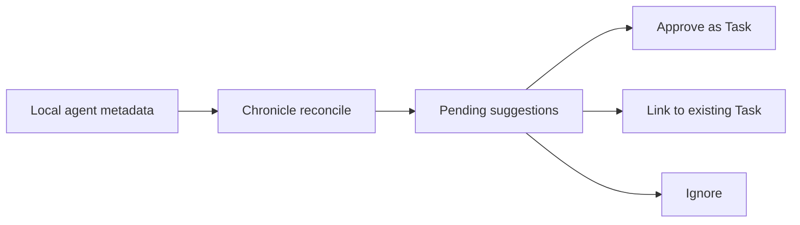

Chronicle scans supported local agent session stores and turns evidence into reviewable suggestions. It does not replace the Taskbean task ledger.

## Review-first model

- Exact matches can link automatically.
- Fuzzy matches remain pending.
- Pending suggestions are not completed work.
- Evidence keeps its original `occurred_at` work time.
- Reports filter evidence by work time, not by the day you reviewed it.

Chronicle stores summaries, source session IDs, repository and branch references, changed files, and confidence. It does not copy raw prompts, responses, or tool output into Taskbean.
