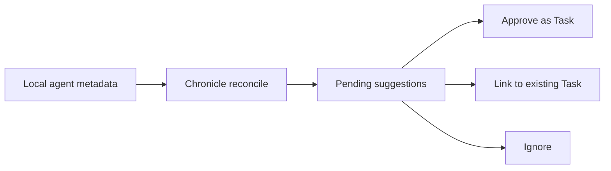

Chronicle scans supported local agent session stores and turns evidence into reviewable suggestions. It does not replace the Taskbean task ledger.

## Review-first model

```mermaid
flowchart LR
  Logs["Local agent metadata"] --> Reconcile["Chronicle reconcile"]
  Reconcile --> Pending["Pending suggestions"]
  Pending --> Approve["Approve as Task"]
  Pending --> Link["Link to existing Task"]
  Pending --> Ignore["Ignore"]
```

- Exact Agent Session matches can link automatically.
- Non-exact matches can also link automatically when their match score is at least `0.88` and leads any runner-up by at least `0.12`. Lower-scoring or ambiguous matches remain pending.
- Pending suggestions are not completed work.
- Evidence keeps its original `occurred_at` work time.
- Reports filter evidence by work time, not by the day you reviewed it.

Chronicle stores summaries, source session IDs, repository and branch references, changed files, and confidence. It does not copy raw prompts, responses, or tool output into Taskbean.

An automatic link attaches evidence to an existing Task; it does not create or complete a Task. Review `auto_linked`, `decision_reason`, and `decision_details` in reconciliation JSON, or inspect automatic links in the desktop report preview.

Use [Chronicle undo](/cli/reference#chronicle-subcommands) to return an automatic link to pending review. A later reconciliation can link it again if it still meets the matching criteria.
