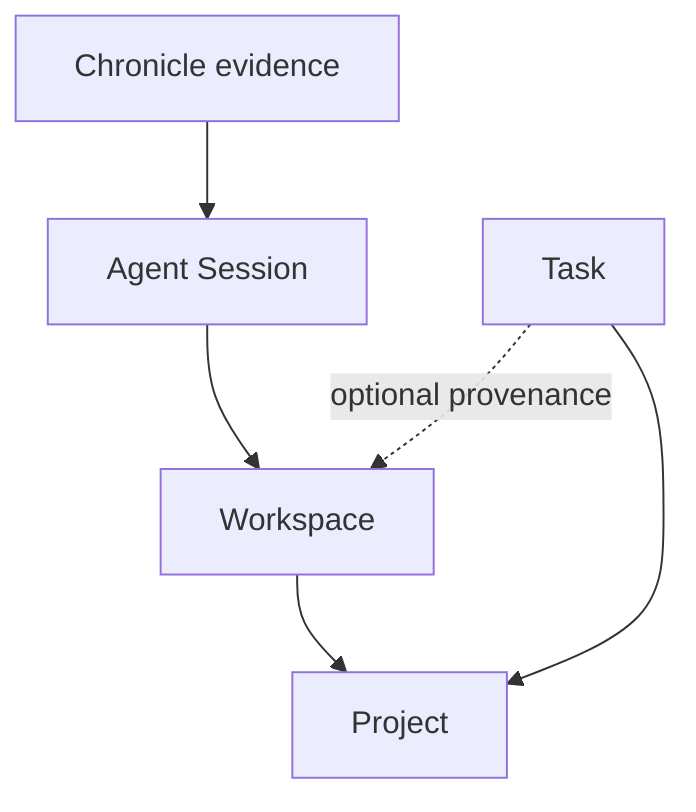

Taskbean has two product surfaces backed by one local data model.

| Surface | Primary user | Responsibility |
| --- | --- | --- |
| `bean` CLI | Coding agents and terminal users | Record and update tasks, manage Projects and Workspaces, install the Agent Skill, reconcile Chronicle evidence, and generate reports |
| Desktop PWA | Developers | Review tasks and evidence, use on-device AI, inspect agent usage, manage reminders, and explore telemetry |

Both surfaces use `~/.taskbean/taskbean.db`. Set `TASKBEAN_HOME` to move the Taskbean data directory or `TASKBEAN_DB` to override the database path.

## Identity and attribution

A Project is logical. A Workspace is physical. Multiple checkouts, worktrees, and forks can roll up to the same Project. Taskbean uses an `owner/repo` Project Key for Git-backed work, preferring `upstream` over `origin`.

Read the [glossary](/concepts/glossary) before designing integrations that create or resolve Projects.

## Independent versions

The CLI, desktop app, and Agent Skill can version independently. Use `bean --version` for the CLI and `GET /api/version` for the app. Follow [GitHub releases](https://github.com/taskbean/taskbean/releases) instead of relying on a hand-maintained version table.

## Platform boundary

The CLI package and compiled binaries target Windows, macOS, and Linux. The current desktop app dependency set includes Windows ML, WMI, PDH, Windows toast notifications, and PowerShell protocol registration. Treat those app capabilities as Windows-specific unless current source proves otherwise.
