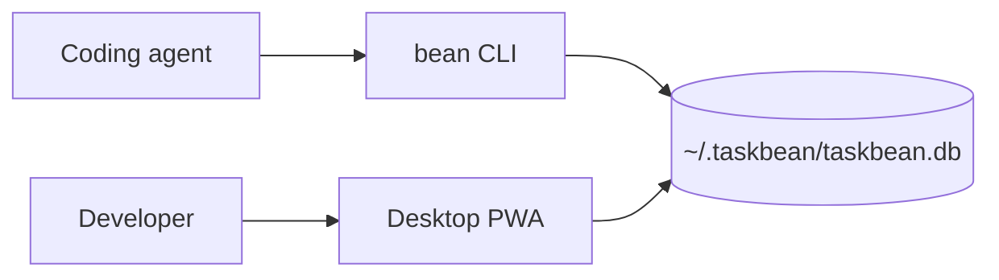

Taskbean is a local-first task manager for developers who work with coding agents. It gives agents a CLI for recording work and gives you a desktop app for reviewing tasks, evidence, usage, reminders, and reports.

## Two halves, one local record

The `bean` CLI and desktop app share the same local SQLite database. The CLI works on Windows, macOS, and Linux. The desktop app includes Windows-specific local AI and notification dependencies, so do not treat its platform support as identical to the CLI.

<CardGroup cols={2}>
  <Card title="Start in five minutes" icon="rocket" href="/quickstart">
    Install the CLI, record a task, add the Agent Skill, and open the app.
  </Card>
  <Card title="Understand the model" icon="diagram-project" href="/concepts/architecture">
    Learn how Projects, Workspaces, Agent Sessions, Tasks, and evidence fit together.
  </Card>
  <Card title="Use the CLI" icon="terminal" href="/cli/lifecycle">
    Track task lifecycle, reports, projects, Chronicle evidence, and skill updates.
  </Card>
  <Card title="Use the desktop app" icon="desktop" href="/app/getting-started">
    Review local work, use on-device AI, manage reminders, and inspect telemetry.
  </Card>
</CardGroup>

## Local-first by design

Taskbean stores tasks, source attribution, aggregate token counts, and review evidence on your machine. Automatic Agent Session and Chronicle ingestion excludes raw prompts, assistant responses, tool output, and code content. User-authored task fields are stored verbatim. See [Privacy and storage](/reference/privacy-storage) for the exact boundary.
